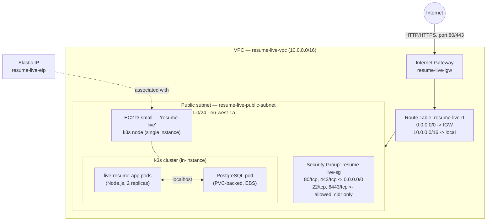

# VPC Architecture — resume-live

Region: `eu-west-1` &nbsp;|&nbsp; Account: `828876760854` &nbsp;|&nbsp; Managed by: `terraform/main.tf`

## Diagram

## Inventory (pulled live from AWS, 2026-08-08)

| Resource | Value |
|---|---|
| VPC | `vpc-0fa699506975cab0a`, `10.0.0.0/16` |
| Subnet | `subnet-02a9d1fa24d08def5`, `10.0.1.0/24`, `eu-west-1a`, **public** (auto-assign public IP) |
| Internet Gateway | `igw-0eab5082a6f01dd47`, attached |
| Route table (subnet-associated) | `rtb-0bfde64a3dc9f2b21` — `10.0.0.0/16 -> local`, `0.0.0.0/0 -> igw` |
| Security group | `sg-039bd8eb6569a5e10` (`resume-live-sg`) |
| NACL | default, allow-all both directions (no custom rules) |
| EC2 instance | `i-0f97889aa2cb383a6`, t3.small, no IAM instance profile attached |
| Elastic IP | `3.248.172.104`, associated with the instance |

### Security group rules

| Port | Protocol | Source | Purpose |
|---|---|---|---|
| 80 | tcp | `0.0.0.0/0` | HTTP (app) |
| 443 | tcp | `0.0.0.0/0` | HTTPS (app) |
| 22 | tcp | `var.allowed_cidr` | SSH |
| 6443 | tcp | `var.allowed_cidr` | k3s API / kubectl |
| all | all | `0.0.0.0/0` | egress |

Until this audit, SSH and the kubectl API were both open to `0.0.0.0/0` — `terraform/variables.tf` already defined an `allowed_cidr` variable for exactly this, but `terraform/main.tf`'s security group never actually referenced it. Fixed by wiring `var.allowed_cidr` into both ingress rules (`terraform/main.tf`) and refreshing `terraform.tfvars` with a current IP — the previously stored value was a stale IPv6 address from a different ISP-assigned prefix, which would have locked out SSH/kubectl entirely if applied as-is. Verified live: SSH and 6443 are reachable from the allowed IP and the rule shows the restricted CIDR in AWS, not `0.0.0.0/0`.

## Is EC2/app tier separated from RDS in public/private subnets?

**There is no RDS.** PostgreSQL runs as a pod inside the k3s cluster, on the same single EC2 instance as the app, using a PVC backed by the instance's EBS volume — not a managed AWS RDS instance. There is also only **one subnet total** (public); no private subnet exists in this VPC.

So the honest answer is: no, there's no tier separation, because there's only one tier. The app, the k3s control plane, and the database all run on one instance in one public subnet. This is a reasonable, low-cost shape for a single-node portfolio demo, but it's not the production-grade pattern (defense in depth via network segmentation, blast-radius containment, DB not directly internet-adjacent).

## Path to real separation (not implemented — cost/complexity tradeoff)

To get genuine public/private separation, at minimum:

1. Add a private subnet (no route to the IGW; a NAT gateway for the app tier's outbound internet access, e.g. pulling container images).
2. Migrate PostgreSQL out of the k3s pod into an actual RDS instance placed in the private subnet, with a security group only allowing inbound `5432` from the app tier's security group.
3. NAT gateway costs roughly $32-35/month plus data processing charges, and a small RDS instance adds its own monthly cost on top of the current single-EC2-instance setup.

This wasn't done as part of this task — it's a meaningful cost and re-architecture decision, not a config tweak, and is called out here as a known gap rather than silently left undocumented.
